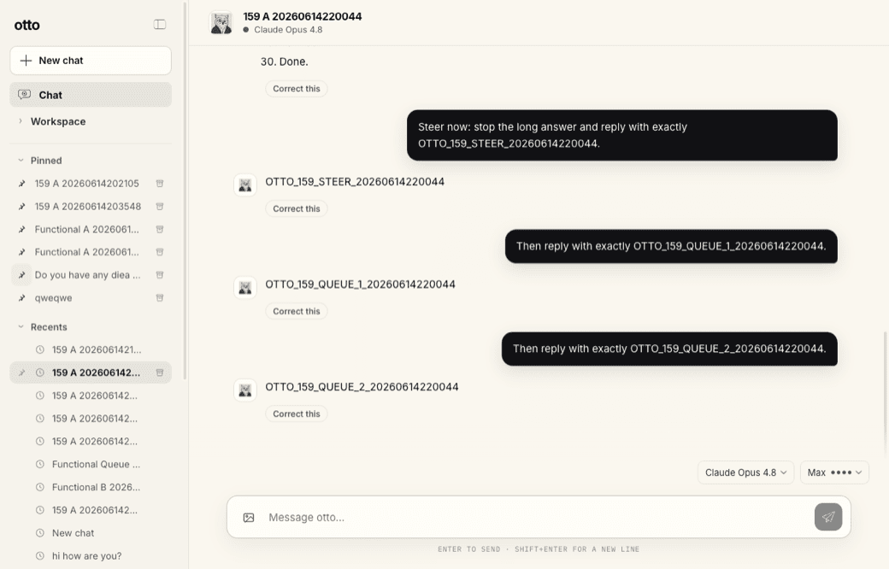

<p align="center">
  <a href="https://github.com/otto-haus/otto/releases/latest/download/otto-v01-desktop.mp4"></a>
  <a href="https://discord.gg/hab9ZvbPH"></a>
  <a href="https://otto.haus"></a>
</p>

# otto

**Define the culture your AI agents run on.**

<p align="center">
  <a href="https://github.com/otto-haus/otto/releases/latest/download/otto-v01-desktop.mp4">
    
  </a>
</p>

<p align="center"><a href="https://github.com/otto-haus/otto/releases/latest/download/otto-v01-desktop.mp4">Watch the desktop demo →</a></p>

Letta remembers. otto improves.

otto is the behavior layer for persistent AI agents.

Memory is what an agent knows. Culture is what it reliably does under pressure. otto turns
Standards, Practices, Routines, approvals, receipts, and corrections into better future
behavior.

> A lesson is not culture until it changes what happens next.

---

## Culture CI

otto is CI for agent behavior: **every correction can become a regression test.**

otto turns ratified corrections into executable **Checks**. If an agent says "done" without proof, you correct it once. otto proposes a rule. You ratify it. From then on, future "done" claims must pass the Check — mapped acceptance criteria, attached evidence, and a receipt.

Culture is no longer only a document. It is a test suite.

---

## What this looks like

Without otto, an agent can remember a correction and still repeat the same mistake.

Example: the agent says “done” without proof. You correct it.

With otto, that correction should become a proposal:

```txt
Pattern:        “done” claimed without evidence
Proposed rule:  completion requires receipts mapped to acceptance criteria
Result:         future done claims must attach test output, logs, or artifacts
Gate:           human ratifies before it becomes canon
```

Once ratified, the correction becomes a Standard, Practice, or receipt requirement.
The next run changes.

Search finds pages. Memory remembers facts. otto changes behavior.

---

## North star

otto exists to make agent behavior compound.

```txt
correction -> proposal -> ratification -> standard/practice/routine -> receipt -> better next action
```

If a feature does not gate irreversibility or make behavior compound, it is probably not
otto.

---

## Primitives

1. **Reversibility is the unit of trust.** Agents should own reversible work. Humans should
   approve irreversible work.
2. **Approve doors, not steps.** The system should not interrupt for safe intermediate
   actions. It should stop at consequential doors.
3. **Receipts over claims.** Done requires proof mapped to the work.
4. **Files are truth. Memory is lessons. UI is workspace.**

---

## What otto is not

- **Not a memory engine.** Letta owns canonical agent memory. otto owns the culture loop
  around memory: what gets proposed, ratified, rejected, repeated, and turned into future
  behavior.
- **Not an orchestrator.** Paperclip can own work orchestration. otto owns behavior
  governance.
- **Not a chat app or RAG product.** otto Shell is a workspace for behavior, approvals,
  receipts, and work state.
- **Not a values poster.** A value that cannot refuse you is decoration.

---

## Core concepts

| Concept | Meaning |
|---|---|
| **Standards** | Explicit canon: what the agent rewards, refuses, and does under pressure. |
| **Practices** | Repeatable behaviors worth preserving. Executable culture. |
| **Checks** | Executable regressions compiled from ratified Standards — enforce at trigger time; failed Checks write blocked Receipts. |
| **Routines** | Repeated bundles of Practices. Recurring attention requires approval. |
| **Charters** | Operating contracts for long-running work: objective, ACs, plan, gates, receipts. |
| **Approvals** | Scoped, time-bound human ratification for one-way doors. |
| **Receipts** | Proof artifacts. No artifact, no progress. |
| **Curation** | The proposal-and-ratification engine in desktop (Ship tier); full spine still maturing. |
| **otto Desktop** | Workspace over runtime readiness, chat, approvals, receipts, and surfaces. |

---

## Reference operating stack

This is the first otto deployment stack, not the definition of otto:

```txt
Letta remembers.      Persistent agent memory and runtime continuity.
otto improves.        Standards, Practices, Checks, Curation, Routines, Receipts.
Paperclip manages.    Goals, tickets, budgets, heartbeats, approvals, audit (reference stack — not shipped in v0.1).
Discord reaches.      Mobile blockers, approvals, field notes, status (Labs — no live bot in v0.1).
```

otto should survive replacement of any substrate except its own behavior layer.

---

## Status

otto is early. v0.1 is a local-first, file-backed release artifact on the **`0.1.x`** line (target gate tag **`v0.1.3`** — **not pushed** until Sebastian approves).

```txt
NOT PUSHED — integration branch ship/functional-labs; no tag; no live app promotion.
```

Source of truth:

- [`RELEASE_CHECKLIST.md`](RELEASE_CHECKLIST.md) — Ship / Labs / Cut tables
- [`docs/v1/ship-tier-matrix.md`](docs/v1/ship-tier-matrix.md) — product tier truth
- [`docs/v1/labs.md`](docs/v1/labs.md) — Labs UX contract
- [`SPEC_COMPLIANCE.md`](SPEC_COMPLIANCE.md)
- [`SHIP_CHECKS/`](SHIP_CHECKS/)

### Ship tier (Labs off — what v0.1 claims)

Works without enabling Labs in Settings. Staging proof on `/Applications/otto-staging.app`.

| Surface | v0.1 |
|---|---|
| Chat, Settings, Desktop shell | ship (live chat requires Letta `session.initialize()`) |
| Charters, Standards, Practices, Routines | ship (file-backed) |
| Curation, Receipts, Checks, Autonomy, Skills, Tickets | ship (Culture CI demo: [`docs/v1/demo-culture-ci.md`](docs/v1/demo-culture-ci.md)) |

### Labs (experimental)

Enable in **Settings → Labs**. Knowledge (Cognee/pgvector), Channels (Discord contract), worker autonomous loop, Letta Cloud — **not** part of public v0.1 shipped claims. See [`docs/v1/labs.md`](docs/v1/labs.md).

### Not in v0.1

Otto Cloud live stack, live Discord bot, Paperclip write integration, always-on cloud sync.

The first falsifiable desktop done test:

> otto Shell launches over Letta and truthfully reports its own state — connected,
> blocked, stale, or ready. Live chat unlocks only after `session.initialize()` succeeds.

---

## Roadmap

- **Now:** otto Shell over Letta, Practices, Charters, Standards, receipts.
- **Next:** Curation hardening, approval records, Long-Run Practice, Paperclip work-state bridge (reference — not v0.1 ship).
- **Then:** Intake for AI-chat exports, source-corpus hooks, relationship-state hooks, packaged install.

The roadmap only matters if each step makes behavior compound or gates irreversibility.

---

## Install

Agents: start with [`INSTALL_FOR_AGENTS.md`](INSTALL_FOR_AGENTS.md).

Humans need [Bun](https://bun.sh), [go-task](https://taskfile.dev) for the `task` shortcuts, and [Letta Desktop / Letta Code](https://letta.com) for the local runtime.

```sh
# macOS
brew install go-task

git clone https://github.com/otto-haus/otto.git
cd otto
bun install
```

Install the Letta Code extension and skills:

```sh
bun run install-extension
# then run /reload in Letta Code
```

This installs Charter/Routine commands, skills, and one-way-door permission gates.

Local desktop app:

```sh
# development Electron app
task electron

# build, package, install to /Applications/otto.app, and open
task refresh
```

Connect the desktop app to Letta:

A fresh clone does not include a hosted agent. Live chat requires a local Letta runtime, provider auth configured in Letta, and a target Letta agent.

1. Open `/Applications/otto.app`.
2. otto tries to discover Letta Desktop and your current local agent automatically.
3. Use **Settings → General** only for advanced runtime/agent overrides.
4. Provider/model credentials stay in Letta. otto does not ask for provider API keys in v1.

Useful checks:

```sh
bun run --cwd apps/desktop typecheck
bun run --cwd apps/desktop electron:typecheck
task release:gate
task smoke:cli   # disposable conversation; never writes to default
```

---

## Verify

```sh
bun run typecheck
bun test
bun run verify:v0
```

Validate Practices:

```sh
bun packages/practices/src/cli.ts
```

---

## otto Desktop

Common commands:

```sh
task dev          # Vite web preview; no desktop bridge
task electron     # Electron app wired to local Letta
task refresh      # build/package/install/open /Applications/otto.app
task ps           # show otto + spawned Letta CLI processes
```

Package scripts:

```sh
bun run --cwd apps/desktop typecheck
bun run --cwd apps/desktop electron:typecheck
bun run --cwd apps/desktop electron:build
```

Runtime truth:

- `OTTO_AGENT_ID` selects the target Letta agent.
- `~/.otto` stores local otto runtime/config/traces.
- `LETTA_CLI_PATH` may point at a specific Letta CLI bundle.
- Chat stays gated until `session.initialize()` succeeds.

Do not claim “connected” unless the SDK initializes against a live agent/session.

---

## Repo map

```txt
otto/
  packages/       shared contracts + PracticeSpec tooling
  apps/desktop/   otto Desktop: Vite + Electron workspace shell
  extension/      Letta Code commands and permission gates
  skill/          Charter and Routine skills
  practices/      practice.yaml specs
  routines/       proposed Routine specs
  standards/      canon, precedents, anti-patterns, registry
  templates/      Charter, Practice, Routine, Standard, Ticket, Worker packets
  docs/           architecture, install, runtime, autonomy, desktop, practices, routines
  AGENTS.md       operating notes for AI coding agents
  INSTALL_FOR_AGENTS.md  agent-first install protocol
  receipts/       proof artifacts for v0.1
  SHIP_CHECKS/    per-surface acceptance checks
```


---

## Community

- Website: <https://otto.haus>
- Discord: <https://discord.gg/hab9ZvbPH>
- GitHub: <https://github.com/otto-haus/otto>

---

## License

[MIT](LICENSE)
