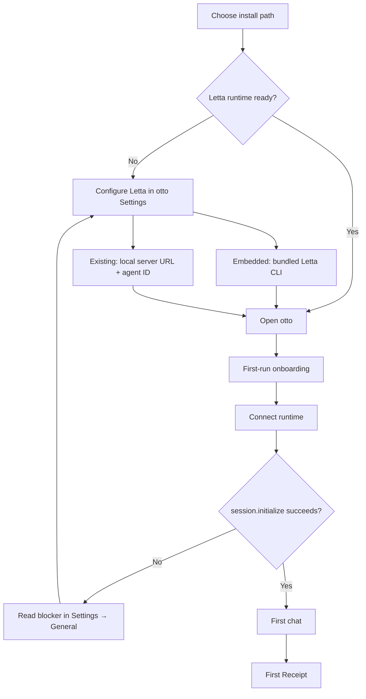

# Getting started with otto

Step-by-step install for humans. Agents should use [`INSTALL_FOR_AGENTS.md`](../../INSTALL_FOR_AGENTS.md).

otto v1 is **local-only**: memory and provider keys live in **Letta**. otto is the behavior layer on top — Standards, Checks, receipts, and the desktop workspace.

---

## Who this is for

| Persona | Best path today | Notes |
|---------|-----------------|-------|
| **Developer early adopter** | Clone repo → `task electron` or `task staging` | Full source, fastest iteration |
| **Future: download & open** | GitHub Release `.dmg` / `.zip` → `/Applications/otto.app` | **Not published yet** on v0.1.3 — spec below |
| **Letta already running** | Packaged or dev otto → Settings → **Existing Letta install** | Point at local URL + agent ID |

---

## End-to-end flow



Numbered path (same story):

1. **Get otto** — clone + dev tools, or (future) download release app.
2. **Install Letta/runtime** — usually **embedded** (no separate Letta Desktop app). Use **existing** only if you already run Letta locally.
3. **Open otto** — `task electron`, `task staging`, or `/Applications/otto.app`.
4. **Connect** — onboarding → Settings; provider keys stay in Letta.
5. **First chat** — composer unlocks after `session.initialize()` succeeds.

---

## Prerequisites (macOS)

| Tool | Why | Install |
|------|-----|---------|
| [Bun](https://bun.sh) | Repo install & scripts | `curl -fsSL https://bun.sh/install \| bash` |
| [go-task](https://taskfile.dev) | `task electron`, `task staging`, … | `brew install go-task` |
| Git | Clone | Xcode CLT or Homebrew |

**Not required for embedded desktop mode:** Docker, Postgres, a separate Letta Desktop download, or API keys inside otto.

Optional: [Letta Code](https://letta.com) CLI if you want Charter/Routine slash commands outside the desktop app.

---

## Path A — Developer (recommended today)

### 1. Clone and install

```sh
git clone https://github.com/otto-haus/otto.git
cd otto
bun install
```

Or use the macOS helper (checks tools, runs the same steps):

```sh
curl -fsSL https://raw.githubusercontent.com/otto-haus/otto/main/scripts/install-otto.sh | bash
# or, from a clone:
bash scripts/install-otto.sh
```

### 2. Optional — Letta Code extension

For slash commands in Letta Code (not required for desktop chat):

```sh
bun run install-extension
# then run /reload in Letta Code
```

### 3. Launch desktop

Pick one:

```sh
# Dev app from this terminal (hot reload)
task electron

# Packaged preview at /Applications/otto-staging.app (isolated profile)
task staging
```

`task staging:build` builds without opening a window (good for CI/agents).

### 4. Connect Letta

On first launch, onboarding walks **Welcome → Connect → Run → Receipt**.

**Recommended — Embedded (“This Mac”):**

- otto uses a **bundled Letta Code CLI** (`@letta-ai/letta-code`).
- You do **not** need to install Letta Desktop separately.
- Add provider/model credentials in Letta when prompted (not in otto Settings).

**Advanced — Existing Letta install:**

- Use when you already run Letta (Desktop app or local HTTP server).
- Settings → set connection mode **Existing**, base URL (e.g. `http://localhost:8283`), and agent ID.
- otto auto-discovers from `~/.letta/settings.json` when possible.

### 5. Verify connection

- Chat stays disabled until **Settings → General** shows ready and `session.initialize()` succeeds.
- Optional smoke (disposable conversation — never `default`):

```sh
OTTO_AGENT_ID=<your-agent-id> task smoke:cli
```

---

## Path B — Future: download release app (spec)

**Status:** GitHub Release [v0.1.3](https://github.com/otto-haus/otto/releases/tag/v0.1.3) ships demo media only — **no `.dmg` / `.zip` desktop artifact yet**. Do not tell users to download an app until Sebastian publishes one.

When a desktop asset exists:

1. Download `otto-*.dmg` or `otto-*.zip` from [GitHub Releases](https://github.com/otto-haus/otto/releases).
2. Install to `/Applications/otto.app` (drag from DMG, or):

```sh
OTTO_ALLOW_RELEASE_INSTALL=1 task install:release
```

3. Open otto → follow onboarding (embedded Letta by default).
4. Configure providers in Letta; return to otto for first chat.

**Homebrew:** not available — requires explicit Sebastian approval before any formula.

---

## Letta prerequisite — honest summary

| Question | Answer |
|----------|--------|
| Do I need Letta Desktop.app? | **No** for embedded mode (default). **Yes** only if you choose existing mode and rely on the Desktop CLI path. |
| Do I need a web server? | Embedded mode runs Letta via bundled CLI. Existing mode needs your **local Letta HTTP URL** (often `localhost:8283`). |
| Where do API keys go? | **Letta only.** otto v1 does not collect provider keys. |
| What is Letta Code vs desktop? | **Letta Code** = CLI/runtime otto talks to. **Letta Desktop** = optional host app for existing mode. Extension install (`install-extension`) is for slash commands in the CLI. |
| When is chat “connected”? | Only after `session.initialize()` against a live agent — not when the window opens. |

Env overrides (when auto-discovery fails):

```txt
LETTA_CLI_PATH=/path/to/letta.js
LETTA_BASE_URL=http://localhost:8283
OTTO_AGENT_ID=<agent-id>
```

---

## Friction audit

| Pain today | Severity | Quick fix | Bigger fix (needs gate) |
|------------|----------|-----------|-------------------------|
| README install block is long | Medium | Link here; shorten README | Mintlify public install page |
| No published `.app` / DMG | **High** | Label “dev install” on site | Publish release artifact + notarize |
| “Install Letta Desktop” confusion | Medium | Embedded-first copy everywhere | Onboarding already has mode picker — align docs |
| `task staging` requires `HEAD=origin/main` | Low (devs) | Document `OTTO_STAGING_REQUIRE_MAIN=0` for branches | — |
| Many env vars | Low | Table above + Settings UI | Doctor task in app |
| Website vs repo install drift | Medium | Site links to this doc | Website team `0e561e6d` owns deploy |

**One-click wins shipped in this branch:**

- `docs/install/getting-started.md` (this file)
- `scripts/install-otto.sh` — macOS bootstrap helper
- README + site install section point here

---

## Onboarding handoff

First-run UI lives in `apps/desktop/src/Onboarding.tsx` (Welcome → mode pick → Settings → chat → receipt). Design canon: [`docs/design/onboarding.md`](../design/onboarding.md).

**For onboarding team:** add a “Install help” link in onboarding footer → this doc (or `docs.otto.haus` mirror when live). Do not duplicate install steps inside the overlay — Settings remains the connection source of truth.

---

## Related docs

- [`README.md`](../../README.md) — project overview
- [`docs/INSTALL.md`](../INSTALL.md) — CI/dev install (contributors)
- [`INSTALL_FOR_AGENTS.md`](../../INSTALL_FOR_AGENTS.md) — agent protocol
- [`docs/v1/runbooks/live-vs-staging.md`](../v1/runbooks/live-vs-staging.md) — otto.app vs otto-staging.app
- [`AGENTS.md`](../../AGENTS.md) — verify commands for agents

---

## Troubleshooting

**Electron dev won’t start**

```sh
node scripts/ensure-electron-ready.mjs
task electron
```

**Staging refused on a feature branch**

```sh
OTTO_STAGING_REQUIRE_MAIN=0 task staging
```

**Letta CLI not found (dev)**

```sh
bun install   # ensures @letta-ai/letta-code in node_modules
# or set LETTA_CLI_PATH to your letta.js
```

**Chat still blocked**

Open **Settings → General**. Read the exact blocker (missing agent, provider auth, CLI path). Do not claim connected until ready.
