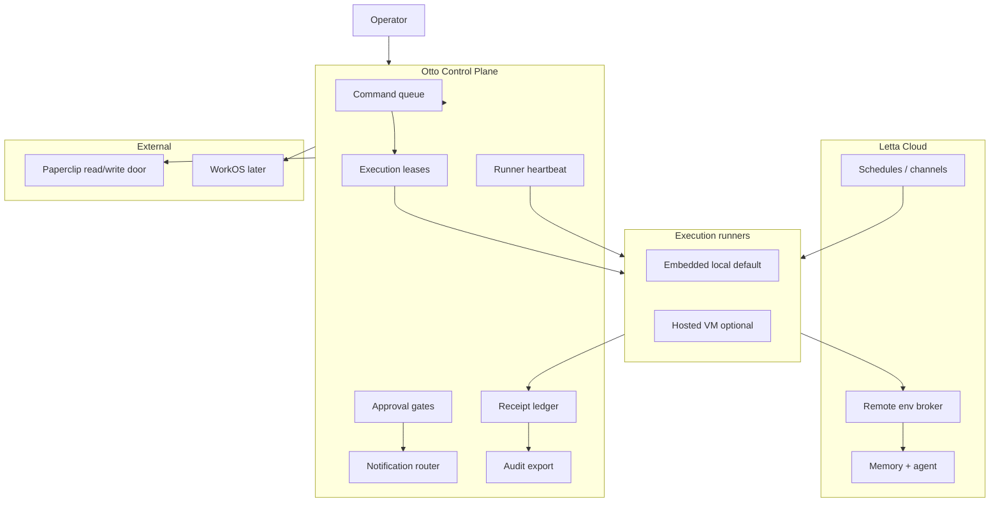

# Agent Control Plane / Always-On Otto — Cathedral Spec

**Status:** proposed (2026-06-14)  
**Ticket:** **092**  
**Related:** `otto-web-spec.md` (Cloudflare slice), **076–079** (runtime), **051** (review gate), **021–022** (Paperclip)

---

## Cathedral (one paragraph)

**Letta Cloud** holds agent state, memory, schedules/channels, and remote environment brokering. **Otto control plane** (Cloudflare + desktop governance) holds identity/workspace (later), command queue, approval gates, execution leases, receipt ledger, runner heartbeat, replay/recovery policy, secret ownership boundaries, notification routing, and audit/export. **Execution runners** are local bundled Letta by default; optional hosted runner (Render/Fly/DO) when filesystem/tools must run while the operator is away. **Paperclip** is external work-state: read-first, writes only through approved otto commands. **WorkOS** only when multi-user/org-shaped (**088**).

The missing piece is not another host — it is the **otto control plane** as a coherent product layer.

---

## Five pillars → ticket map

| Pillar | Cathedral requirement | Covered today? | Tickets |
|--------|----------------------|----------------|---------|
| **1. Letta Cloud** | Agent memory, schedules, channels, remote env broker | Partial | **077**, **079**, **085**, **086**; desktop **076** |
| **2. Otto control plane (CF + rules)** | Identity, org/workspace, approvals, receipts, proposals, ticket state, audit log, notifications | Partial | **082–084**, **087**, **088**; desktop **014–017**, **051** |
| **3. Execution runners** | Local default; hosted when away | Partial | **076**, **086**, **060** (local worker only) |
| **4. Paperclip** | Read-only import; gated writes | Parked | **021–022**, **074–075** |
| **5. WorkOS** | Org RBAC | Parked | **088** |

**Verdict:** Shipping **001–091** delivers **v0.1 local otto + cloud scaffold + adapters queued**. It does **not** deliver a unified control plane with command queue, leases, heartbeat, and replay as specified below.

---

## Control plane subsystems (must be specified)

### 1. Command queue

Durable intent queue: who requested what, for which ticket/charter/worker, priority, cancel/retry.

| Layer | Owner | Notes |
|-------|-------|-------|
| Operator/chat intent | Otto CP | Enqueued with receipt id |
| Letta turn execution | Letta + runner | Dequeue via session/worker lease |
| Paperclip task mirror | Adapter | Import only until **022** |

**Gap:** No ticket defines queue schema, Workers Queue vs D1, or desktop↔cloud queue merge. **Implementation:** **094+** after **092** accepted.

### 2. Approval gates

Irreversible/external actions require explicit decision + record.

| Surface | Status |
|---------|--------|
| Desktop autonomy + Curation | **017**, **016** done |
| Chat permission modal | **045** |
| No fake Done | **051** |
| Cloud approval records | **084** sketch only |
| Letta remote HITL | Letta Cloud (external) |
| Paperclip writes | **022** parked |

**Rule:** One gate semantics everywhere — adapter seam (**021**).

### 3. Execution leases

Exclusive right to run a bounded slice (ticket, worker, schedule fire) on a runner.

| Concern | Status |
|---------|--------|
| Ticket worktrees | **035**, orchestrator exists |
| Worker bounded run | **060** (local) |
| Cloud lease + TTL | **Not ticketed** |
| Letta schedule + listener | Documented in **082**; no otto lease id |

**Gap:** **095** — execution lease contract + heartbeat coupling.

### 4. Receipt ledger

Append-only proof of actions; index in D1, blobs in R2.

| Surface | Status |
|---------|--------|
| Desktop Receipts | **003** done |
| Cloud ledger | **084** |
| Sync | **089** parked |
| Export/audit bundle | **Not ticketed** |

**Gap:** **096** — audit export story (operator bundle, not raw Letta memory).

### 5. Runner heartbeat

Runners (local embedded, remote VM, future hosted) report: env name, agent id, listener up, last turn, lease holder, disk/volume ok.

| Surface | Status |
|---------|--------|
| Letta env connected/disconnected | **085** read proxy |
| Otto heartbeat schema + stale alerts | **Not ticketed** |
| Paperclip heartbeats | **021** import context only |

**Gap:** **097** — runner heartbeat + stale-runner notification policy.

### 6. Replay / recovery

After crash, disconnect, or missed schedule: honest state, resumable queue, no silent duplicate execution.

| Surface | Status |
|---------|--------|
| WS stream recovery | **039** |
| Chat error retry queue | **003** done |
| Control-plane replay | **Not ticketed** |
| Schedule missed (listener down) | **082** banner only |

**Gap:** **098** — replay/recovery policy (idempotency keys, lease expiry, queue redelivery).

### 7. Secret ownership

| Secret class | SoR | Otto role |
|--------------|-----|-----------|
| Provider/API keys | Letta Cloud / OS keychain | **078** mirror write-only |
| Otto admin/sync tokens | CF Secrets | **083+** |
| Paperclip credentials | Adapter vault | **021** connect door |
| WorkOS session | WorkOS | **088** |

**Rule:** Otto never displays or logs secret values (AGENTS.md).

### 8. Letta Cloud / local fallback

| Mode | When | Tickets |
|------|------|---------|
| Embedded local (default) | Desktop, compounding loop | **076** |
| Letta Cloud remote | Away, schedules, channels | **077**, **085–086** |
| Explicit fallback | No silent cloud | **079** |

**Rule:** Mode is operator-visible; no silent fallback to cloud.

### 9. Paperclip adapter boundary

```txt
Paperclip = work plane (tasks, budgets, external runs)
Otto      = behavior governance (canon, approvals, receipts)
```

Read: **021**. Write: **022** only from ratified tickets with approval + receipt. Status: **075** (complete ≠ Done).

### 10. Notification policy

Route by severity + autonomy class: in-app, Discord (**020**/**087**), email (later), Letta remote approve.

| Class | Default route |
|-------|----------------|
| Info receipt | In-app / cloud feed |
| Approval required | Discord + cloud + Letta HITL if tool |
| Blocked / stale runner | Cloud status + optional ping |
| Review requested | Ticket state + **051** |

**Gap:** **099** — notification policy doc + routing table (implement **087** + cloud).

### 11. Audit / export

Operator can export: receipts, approval records, ticket transitions, adapter audit (Paperclip), queue history — **not** Letta memory blocks or provider keys.

**Gap:** **096** (may combine with ledger).

---

## Architecture (control plane centric)



---

## Phased delivery (after this spec)

| Phase | Ticket | Outcome |
|-------|--------|---------|
| **0** | **092** | This spec + reviewer +1 |
| **1** | **094** | Command queue schema + local desktop queue (D1/JSON stub) |
| **2** | **095** | Execution lease + worker/ticket binding |
| **3** | **097** | Runner heartbeat + stale detection |
| **4** | **098** | Replay/recovery + idempotency |
| **5** | **096** | Audit export bundle |
| **6** | **099** | Notification policy + wire **020**/**087** |
| **7** | Cloud | **083–089** implement CP on CF |

**093** (multi-agent policy) is orthogonal — see below.

---

## Multi-agent policy (summary)

**Default:** one primary otto agent per workspace — memory continuity is the product.

**Allow multiple agents only behind advanced/isolation flow when boundary is real:**

- different human owner
- different authority level
- different secrets/tools
- different schedule/channel
- different long-running mission
- isolation need (e.g. finance vs code)

**Do not** center UI on agent fleet. Architecture may support N agents; product ships one.

Full ADR: **093** (`docs/v1/adr/093-multi-agent-workspace-policy.md`).  
Implementation: **119** (primary default UX), **120** (advanced second agent, parked).

---

## Done test (cathedral)

> Sebastian closes the laptop. Otto Cloud shows: pending approvals, last receipt, runner heartbeat green, next Letta cron will fire. A queued ticket command holds a lease on the hosted runner. Paperclip task completion triggers review-requested — not Done. Export produces an audit bundle without secrets. One primary agent; second agent only if explicitly created under advanced isolation.

---

## References

- [Letta remote environments](https://docs.letta.com/letta-code/remote/)
- [Letta configuration](https://docs.letta.com/letta-code/configuration/)
- [Cloudflare storage options](https://developers.cloudflare.com/workers/platform/storage-options/)
- [Cloudflare cron triggers](https://developers.cloudflare.com/workers/configuration/cron-triggers/)
- [Render persistent disks](https://render.com/docs/disks)
- [WorkOS roles](https://workos.com/docs/authkit/roles-and-permissions)
- `docs/v1/otto-web-spec.md`
- `docs/v1/hosted-health-monitoring.md` (**331** runner heartbeat + support bundle)
- `docs/v1/contracts/adapter-seam.md`
