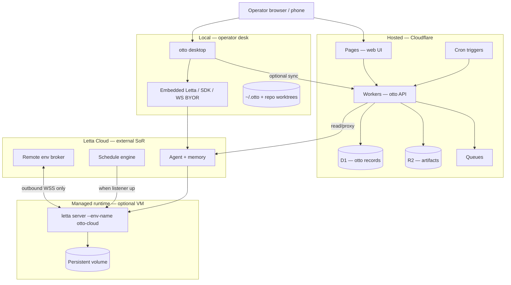
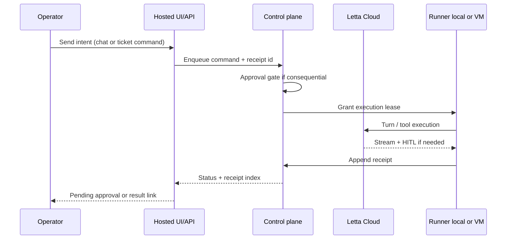
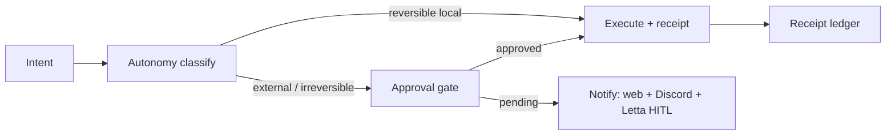
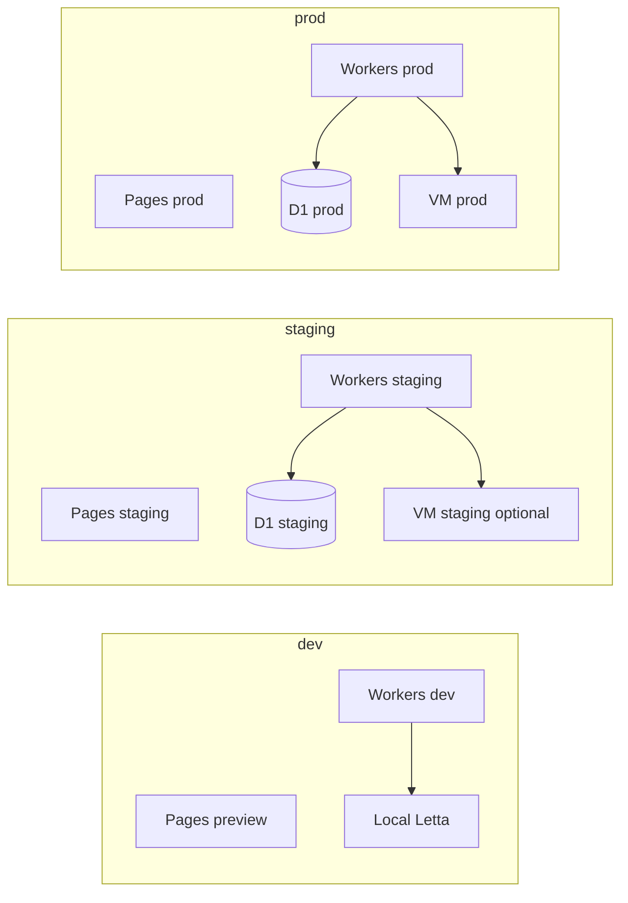

# Hosted / Managed Otto — Architecture

**Status:** proposed (2026-06-14)  
**Issue:** [#328](https://github.com/otto-haus/otto/issues/328)  
**Priority:** p2  
**Umbrella:** [`agent-control-plane-spec.md`](agent-control-plane-spec.md) (**092**)  
**Slices:** [`otto-web-spec.md`](otto-web-spec.md) (Cloudflare topology), [`runtime-transport.md`](../runtime-transport.md) (desktop modes)

---

## One sentence

**Hosted otto** is otto’s **control plane and operator visibility layer on Cloudflare**, with **Letta Cloud** as agent memory/runtime broker and an **optional managed VM** for tool/filesystem execution — while **desktop otto** remains the primary local command station and compounding loop.

```txt
Desktop otto     = local command station (embedded Letta default)
Hosted otto      = cloud control plane + away-mode visibility + optional sync
Letta Cloud      = agent memory, schedules, channels, remote env broker
Managed VM       = always-on `letta server` when tools/repos need a real machine
```

---

## System context



---

## Account / workspace model

Hosted otto is **workspace-scoped**, not agent-fleet-scoped. One primary agent per workspace unless advanced isolation is explicitly created (ADR **093**).

| Entity | Owner | Hosted storage | Notes |
|--------|-------|----------------|-------|
| **Tenant** | Otto CP | D1 `tenants` | v1: single row (Sebastian); schema multi-tenant day one |
| **Workspace** | Otto CP | D1 (1:1 with tenant v1) | Canon root, ticket folder mirror, autonomy policy ref |
| **Operator** | Otto CP | D1 `operators` | Human identity; WorkOS ref later (**#104**) |
| **Primary agent** | Letta Cloud | Letta | `primaryAgentId` in desktop config mirrors Letta agent id |
| **Letta link** | Otto CP | D1 `letta_links` | agent id, env names, last probe — not memory |

**Rules**

- Workspace maps **1:1 to primary agent** by default (**#107**).
- Secondary agents require advanced flow + boundary receipt (**#107**, desktop **119**).
- Billing/org RBAC deferred until WorkOS (**#104**); v1 admin via CF Access or signed admin token.

---

## Hosted conversation / session model

Conversations are **Letta-owned**; otto stores **session handles and governance metadata** only.

| Concept | Source of truth | Hosted role |
|---------|-----------------|-------------|
| **Letta conversation** | Letta Cloud | Runtime turn history, tool calls, HITL |
| **Otto thread** | Desktop D1/SQLite + optional cloud mirror | UI thread list, queue state, attachments metadata |
| **Command session** | Otto CP queue | Durable intent: ticket/worker/schedule fire id |
| **Execution lease** | Otto CP | Exclusive runner right for bounded work (**#109**) |
| **Smoke session** | Disposable only | Never `conversation=default` (AGENTS.md) |



**Rules**

- Web chat is a **thin client** over Letta + CP — not a second memory system.
- Desktop threads may push receipt/proposal cursors to cloud (**#105**); conflict: **disk/folder truth wins** until sync contract accepted.
- Session ids in logs are opaque; no provider keys or memory block contents in D1.

---

## Managed runtime execution boundary

| Layer | Runs what | Where | Ingress |
|-------|-----------|-------|---------|
| **Cloudflare Workers** | Coordination API, webhooks, cron, queue consumers | CF edge | Public HTTPS (auth gated) |
| **Letta Cloud** | Agent memory, schedule firing, channel delivery, env broker | Letta SaaS | Letta API / WSS |
| **Managed VM** | `letta server`, repo tools, filesystem | Render/Fly/Railway/DO | **Outbound WSS only** — no public SSH |
| **Desktop embedded** | Default local runtime | Operator machine | Loopback only |

**Managed runtime contract** (detail in **#330**):

- Tool execution policy inherits desktop `AutonomyPolicy` + approval classes.
- Secrets never stored in otto D1; Letta/keychain/CF Secrets Store only.
- Queue + lease before side-effecting work (**#108**, **#109**).
- Sleep/background = Letta cron + connected listener — otto shows honest “listener down” state.

Workers **must not** run `letta server` or coding-agent processes.

---

## Memory / storage boundary

| Data class | Source of truth | Hosted copy | Sync |
|------------|-----------------|-------------|------|
| Agent memory blocks | Letta Cloud | None | Never mirror into D1 |
| Standards/Practices/Routines | Repo + desktop canon | Optional read mirror | Proposal-only via Curation |
| Receipts / proposals | Desktop + CP ledger | D1 index + R2 blobs | Push optional (**#105**) |
| Tickets / charters | Repo folders | D1 mirror + path ref | Import/read first |
| Attachments | Local FS + Letta context | R2 if uploaded | Operator-initiated |
| Provider/API keys | Letta / OS keychain | Boolean flags only | **#96** mirror write-only |
| Cognee graph | Local sidecar (**#67**) | Not in v1 hosted | Parked |

**Rules**

- Otto Cloud indexes **proof and governance records**, not Letta memory.
- Artifacts (logs, screenshots, exports) → **R2**; metadata → **D1**.
- Export/audit bundle includes receipts and approvals — **not** memory blocks (**#110**).

---

## Tool / permission / approval routing

Same gate semantics everywhere ([`adapter-seam.md`](contracts/adapter-seam.md)):

```txt
intent → classify(autonomy class) → approval if irreversible/external → execute → receipt
```

| Surface | Approval UI | Implementation |
|---------|-------------|----------------|
| Desktop chat | Permission modal | **045**, desktop autonomy **017** |
| Desktop curation | ProposalStore.decide | **016** |
| Hosted web | D1 approval records + Letta HITL deep link | **#100**, Letta remote |
| Discord / Slack | Webhook → CP → notify | **#103** |
| Letta tool HITL | chat.letta.com / Letta Code | External |
| Paperclip writes | Gated adapter door only | **#61**, **#22** parked |



**Rules**

- No silent cloud execution of consequential actions.
- `auto` transport never falls back to cloud (**[`runtime-transport.md`](../runtime-transport.md)**).
- Paperclip task complete ≠ otto Done (**#51** pattern).

---

## Local desktop ↔ cloud handoff

| Scenario | Local | Cloud | Handoff |
|----------|-------|-------|---------|
| At desk, compounding | Primary | Idle / read-only | Desktop owns turns |
| Away, check status | Optional | Primary visibility | Web status + receipts |
| Away, approve door | Push notify | Decision surface | Same ProposalStore rules |
| Cron while laptop closed | Listener on VM | Shows schedule + listener state | **#101** |
| Return to desk | Resume embedded | Sync cursor optional | **#105** |

```txt
Handoff invariants:
1. Mode is operator-visible (connectionMode, transportMode, env connected).
2. No silent canon merge from cloud to disk.
3. Queue merge requires explicit contract (#105) — until then, separate queues with receipt ids.
4. Folder/ticket state on disk remains truth for repo-backed work.
```

Desktop config anchors (`~/.otto/config.json`): `primaryAgentId`, `connectionMode`, `conversationId` — see **runtime-transport.md**.

---

## Observability, audit logs, and health checks

| Signal | Emitter | Store | Consumer |
|--------|---------|-------|----------|
| **API health** | Workers `/api/health` | — | CF uptime, deploy smoke |
| **Aggregate status** | Workers `/api/status` | D1 cache short TTL | Web home, **#331** |
| **Runner heartbeat** | Local + VM runner | D1 | Stale-runner alerts (**#111**) |
| **Receipt ledger** | All surfaces | D1 + R2 | Runs & receipts UI |
| **Audit export** | CP export job | R2 bundle | Operator compliance (**#110**) |
| **Letta env probe** | Workers proxy | D1 `letta_links` | Remote env panel (**#101**) |
| **Queue depth / age** | CP metrics | D1/Analytics | **#331**, on-call |

Public health: liveness only. Per-workspace health: authenticated. Support debug bundle: receipts + config flags — **no secrets** (**#331**).

---

## Local vs cloud responsibility split

| Concern | Local desktop | Hosted cloud | External (Letta) |
|---------|---------------|--------------|------------------|
| Primary UX / editing | **Owns** | Thin slices | — |
| Agent memory | Uses | — | **Owns** |
| Tool execution default | **Owns** (embedded) | — | Brokers |
| Tool execution away | — | Orchestrates | Executes via VM |
| Provider/API keys | Keychain mirror | Boolean flags | **SoR** |
| Curation / ratification | **Owns** | Mirror + decide | — |
| Approvals | **Owns** UI | **Owns** away UI | HITL transport |
| Receipts | **Owns** write | Index + optional push | — |
| Schedules display | Read | Read + honest banner | **Owns** firing |
| Ticket/repo truth | **Owns** (disk) | Mirror/read | — |
| Org/auth multi-user | — | Scaffold | WorkOS later |
| Audit export | Partial | **Owns** bundle | — |

---

## Security and privacy risks

| Risk | Impact | Mitigation | Owner ticket |
|------|--------|------------|--------------|
| **Secret leakage via logs/UI** | Provider key exposure | Boolean-only secret checks; never log values | AGENTS.md, **#96** |
| **Silent cloud fallback** | Unapproved remote execution | `auto` = local only; explicit `cloud` mode | **079**, **#95** |
| **Memory exfil via D1** | Privacy breach | D1 excludes Letta memory; export excludes blocks | This doc, **#110** |
| **Public VM ingress** | RCE surface | Outbound WSS only to Letta | **#102** |
| **Webhook forgery** | Spoofed approvals | HMAC signature verification | **#103** |
| **Cross-tenant data bleed** | Multi-tenant incident | `tenant_id` on all D1 rows; CF Access v1 | **#100**, **#104** |
| **Duplicate execution after crash** | Double spend / double merge | Leases + idempotency keys | **#109**, **#112** |
| **Fake “scheduled” UX** | False confidence | Banner when listener down | **082**, **#101** |
| **Paperclip write bypass** | Unapproved canon change | Adapter seam; read-first | **#61** |
| **Support bundle over-collection** | PII in tickets | Redact paths; no memory export | **#331** |
| **Desktop↔cloud canon conflict** | Split brain | Disk wins; explicit sync contract | **#105** |

Privacy stance: hosted v1 targets **single operator (Sebastian)**; team hosting requires WorkOS + tenant isolation review (**#104**) before external pilots (**#114**, **#117**).

---

## Deployment environments (dev / staging / prod)

Hosted stack is **Cloudflare-centric**; managed VM is **per-environment optional**.

| Environment | Purpose | CF resources | VM | Auth | Data |
|-------------|---------|--------------|-----|------|------|
| **dev** | Engineer iteration | Workers/Pages preview branch | Local `letta server` or none | CF Access dev group / API token | Disposable D1 (branch DB) or local miniflare |
| **staging** | Pre-prod smoke, Sebastian gate | `otto-staging.*` subdomain, staging D1/R2 | Optional `otto-cloud-staging` env | CF Access staging | Isolated tenant; no prod receipts |
| **prod** | Managed pilot / always-on | `app.otto.haus` (TBD **065**) | `otto-cloud` prod env | CF Access + future WorkOS | Production D1/R2; backup policy TBD |



**Deploy rules**

- Desktop staging (`otto-staging.app`) is separate from cloud staging — see [`runbooks/live-vs-staging.md`](runbooks/live-vs-staging.md) (**091**).
- Cloud prod deploy requires Sebastian merge gate; no agent self-certify Done.
- Smoke tests use disposable Letta conversations only.
- Secrets: CF Secrets Store per environment; no shared prod keys in dev.

**Runbook:** [`runbooks/cloud-deploy-dev-staging-prod.md`](runbooks/cloud-deploy-dev-staging-prod.md) (**#462**).

---

## Phased implementation map

| Phase | Outcome | Issue |
|-------|---------|-------|
| 0 | This architecture + cathedral spec | **#328**, **092** |
| 1 | CF Pages shell + health | **#99** |
| 2 | D1 records API (receipts, proposals) | **#100** |
| 3 | Letta Cloud read (envs, schedules) | **#101** |
| 4 | Managed VM template | **#102** |
| 5 | Discord approval webhooks | **#103** |
| 6 | WorkOS orgs (parked) | **#104** |
| 7 | Desktop↔cloud sync contract | **#105** |
| 8 | Monorepo `apps/cloud/` ADR | **#106** |
| 9 | Command queue | **#108** |
| 10 | Execution leases | **#109** |
| 11 | Audit export | **#110** |
| 12 | Runner heartbeat | **#111** |
| 13 | Replay / recovery | **#112** |
| 14 | Notification policy | **#113** |
| 15 | Cloud deploy runbook dev/stg/prod | **#462** |
| 16 | Managed runtime contract (detail) | **#330** |
| 17 | Health / support diagnostics | **#331** |
| 18 | Product brief / non-goals | **#327** |

---

## Done test

> Sebastian closes the laptop, opens hosted otto on phone, sees last receipt + pending approvals + whether the managed runtime listener is connected, knows if the 9am Letta cron will fire, and can approve a consequential door — without SSH, without four logins, and without otto pretending it owns Letta memory or local repo truth.

---

## References

- [`agent-control-plane-spec.md`](agent-control-plane-spec.md)
- [`otto-web-spec.md`](otto-web-spec.md)
- [`runtime-transport.md`](../runtime-transport.md)
- [`contracts/adapter-seam.md`](contracts/adapter-seam.md)
- [`adr/093-multi-agent-workspace-policy.md`](adr/093-multi-agent-workspace-policy.md)
- [Letta — Remote environments](https://docs.letta.com/letta-code/remote/)
- [Letta — Scheduling](https://docs.letta.com/letta-code/scheduling/)
- [Cloudflare Workers storage](https://developers.cloudflare.com/workers/platform/storage-options/)
