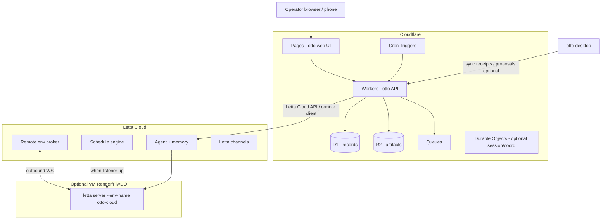

# Otto Web / Otto Cloud — Architecture Spec

**Status:** proposed (2026-06-14)  
**Scope:** always-on otto beyond the desktop shell  
**Umbrella:** `agent-control-plane-spec.md` (**092**) — this doc is the **Cloudflare + Letta topology slice**  
**Depends on:** desktop substrate **076** (embedded Letta) for parity; does not block spec  
**Supersedes:** ad-hoc “Render app + Cloudflare + WorkOS + Letta Cloud” four-authority stack

---

## One sentence

**Otto Cloud** is otto’s **control plane on Cloudflare** — curation, approvals, receipts, schedules-as-product-records, and operator UI — while **Letta Cloud** owns agent memory, remote environments, execution brokering, and Letta-native schedules/channels.

```txt
Download otto (desktop)     = local command station
Open otto.haus / app        = cloud control plane + visibility
Letta Cloud                 = agent runtime broker (memory, remote env, cron, channels)
Remote VM (optional)        = always-on `letta server` when tools/files need a real machine
```

---

## Authority split (non-negotiable)

| Layer | Owns | Does not own |
|-------|------|----------------|
| **Otto Cloud (CF)** | Product UI/API, org/session (later), curation records, approval records, receipts index, ticket/charter mirrors, otto cron for *product* workflows, webhooks into otto | Agent memory, tool execution, provider secret SoR, Letta schedule engine |
| **Letta Cloud** | Agent identity, memory, remote env registry, schedule firing *to agent*, channel delivery *for agent*, remote approval transport, BYOK/provider auth SoR | Otto canon, Done/review gates, Paperclip truth, billing (initially) |
| **Remote env (VM)** | Long-lived `letta server`, filesystem, repo checkout, tool sandbox | Public ingress (outbound WS only to Letta Cloud) |
| **WorkOS (later)** | Customer auth, orgs, RBAC for otto Cloud | Letta runtime auth (Letta OAuth/API key stays in Letta) |

**Rule:** Do not build an otto Letta broker. Call Letta Cloud APIs / remote client patterns (**077**, **079**).

**Rule:** Cloudflare Workers run **coordination**, not coding-agent processes. No `letta server` on Workers.

---

## Why four authorities collapse to three (WorkOS deferred)

Starting with Render + Cloudflare + WorkOS + Letta Cloud creates four session models and four places secrets can leak.

**Minimum viable always-on stack:**

1. **Cloudflare** — otto web UI + API + durable records + cron/queues  
2. **Letta Cloud** — agent + schedules + channels + remote env broker  
3. **One VM/container** (Render / Fly / Railway / DO) — only if hosted sandboxes are insufficient for repo/tools  

**WorkOS** when otto has paying teams and org-scoped canon — not for Sebastian’s personal always-on agent v1.

Early admin auth: Cloudflare Access, signed admin cookie, or single-tenant API token — document choice in Phase 1 ticket.

---

## Letta Cloud capabilities (external — do not reimplement)

From [Letta remote environments](https://docs.letta.com/letta-code/remote/) and [scheduling](https://docs.letta.com/letta-code/scheduling/):

### Remote environments

- `letta server --env-name <name>` registers an execution environment via **outbound WebSocket** to Letta Cloud.
- No inbound ports, reverse proxy, or public domain on the VM.
- Agent memory moves with the agent across environments (conversation history, context repos).
- Remote approval flow surfaces on chat.letta.com / Letta Code app when tools need HITL.

### Schedules (`letta cron`)

- Tasks bound to **agent + conversation**; fire only while a **`letta server` listener is connected**.
- Up to 50 active tasks per agent; cron in local TZ; missed one-shots if listener down >5m.
- Otto Cloud may **display, link, or request** schedule creation — execution stays Letta-side.

### Channels (Letta)

- Letta Code app “Channels” tab — distinct from otto `channels.md` (Discord reachability).
- Otto Cloud documents both; does not merge namespaces without adapter seam.

---

## Otto Cloud — logical architecture



---

## Otto Cloud surfaces (v1 web)

Thin slices — no dashboard cosplay. Honest empty states.

| Surface | Source of truth | v1 behavior |
|---------|-----------------|-------------|
| **Home / status** | Otto API + Letta status probe | Connected envs, last run, blockers |
| **Runs & receipts** | D1 + R2 blobs | List/filter; link to artifact |
| **Curation inbox** | D1 (mirror of desktop proposals) | Read + decide (same seam as desktop) |
| **Approvals** | D1 approval records | Pending doors; deep link Letta remote approve when tool HITL |
| **Schedules** | Letta Cloud (read) | List `letta cron` via API/wrapper; show listener requirement |
| **Remote envs** | Letta Cloud | Env name, connected/disconnected, last seen |
| **Channels (otto)** | `channels.yaml` + D1 | Discord approval bridge (**020**) — not Letta channels |
| **Settings** | D1 + CF secrets | Letta Cloud link/OAuth; no provider key display |

Desktop remains primary for heavy editing (Standards, Charters, Practices). Web is **command station when away**.

---

## Data model (D1 sketch)

Otto-owned records only — not Letta memory blocks.

```txt
tenants           id, name, created_at                    -- single row v1
operators         id, email, auth_provider_ref             -- WorkOS id later
receipts          id, tenant_id, kind, subject_json, r2_key, created_at
proposals         id, tenant_id, source, status, payload_json, decided_at
approval_records  id, tenant_id, scope_json, status, letta_control_ref nullable
tickets           id, tenant_id, folder_path, status, paperclip_ref nullable
sync_cursors      tenant_id, surface, cursor_json          -- desktop ↔ cloud optional
letta_links       tenant_id, agent_id, env_names_json, updated_at
```

Artifacts (logs, screenshots, HTML exports) → **R2**. Never store provider keys in D1.

---

## API boundaries (Workers)

```txt
GET  /api/health
GET  /api/status                    -- aggregate Letta + env + last receipt
GET  /api/receipts
GET  /api/receipts/:id
GET  /api/curation/proposals
POST /api/curation/proposals/:id/decide   -- same rules as ProposalStore
GET  /api/approvals
GET  /api/schedules                 -- proxy/read Letta; cache short TTL
GET  /api/remote-envs               -- proxy/read Letta
POST /api/webhooks/discord          -- 020 bridge
POST /api/webhooks/letta            -- optional: run complete → review requested (075 pattern)
POST /api/sync/receipts             -- desktop push (authenticated)
```

All mutating routes: autonomy class + approval where external side effect.

---

## Remote execution environment (optional VM)

**When needed:** agent must clone repos, run tools, hold filesystem state between cron fires.

**When skipped:** Letta hosted sandboxes sufficient for chat-only always-on.

**Template:** fork [letta-code-server-deployment](https://github.com/letta-ai/letta-code-server-deployment) or DO/Fly/Railway docs from Letta.

```txt
Service: letta server --env-name otto-cloud
Volume:  ~/.letta/ persistent (OAuth tokens)
Egress:  outbound HTTPS/WSS to Letta Cloud only
Secrets: LETTA_API_KEY (Developer plan) OR one-time OAuth device flow
```

Otto Cloud stores **env name + health**, not VM SSH keys in v1.

---

## Schedules — product semantics

Two schedule layers — do not conflate:

| Layer | Owner | Example |
|-------|-------|---------|
| **Letta cron** | Letta Cloud | “Every weekday 9am: triage inbox prompt to agent” |
| **Otto cron (CF)** | Cloudflare | “Every hour: sync receipts from desktop”, “digest open approvals” |

Otto web **shows** Letta schedules with banner:

> Runs only while `otto-cloud` environment is connected.

Otto may offer “ensure listener up” checklist linking to VM deploy ticket — not fake “scheduled” if listener down.

---

## Channels — product semantics

| Name | Meaning |
|------|---------|
| **Letta channels** | Letta Code scheduling/delivery features (Letta docs) |
| **Otto channels** | Discord/Slack reachability for approvals (**channels.md**, **020**) |

Otto Cloud UI labels them explicitly: “Letta delivery” vs “Otto reachability”.

---

## Desktop ↔ Cloud relationship

```txt
Desktop (076)  = primary workspace; embedded Letta default
Cloud          = visibility + approvals away from desk + optional sync
```

Sync is **optional**, receipt-backed, never silent canon merge:

- Desktop may push receipts/proposals to D1 (operator-initiated or cron).
- Cloud decisions write back via same `ProposalStore.decide` rules — not a second ratification path.

Conflict rule: **folder/ticket state on disk remains truth**; see [`contracts/desktop-cloud-sync.md`](contracts/desktop-cloud-sync.md) for per-class conflict and offline behavior.

---

## Security

- Provider keys: Letta Cloud / keychain only; otto Cloud boolean flags.
- CF Secrets Store for otto API keys, webhook HMAC, Letta service tokens (if any).
- No public VM ingress; VM outbound-only.
- Admin UI behind CF Access or equivalent until WorkOS.
- All webhooks signature-verified.

---

## Phased delivery

| Phase | Outcome | Ticket |
|-------|---------|--------|
| **0** | This spec + ADR in adapter seam | **082** |
| **1** | CF Pages shell + health + static status (otto.haus app subdomain) | **083** |
| **2** | D1 schema + receipts/proposals read API + R2 | **084** |
| **3** | Letta Cloud read: agents, envs, schedules (no broker rewrite) | **085** |
| **4** | VM template `otto-cloud` env + deploy docs (Render/Fly) | **086** |
| **5** | Discord/web approval bridge on Workers (**020** unpark) | **087** |
| **6** | WorkOS org auth + tenant RBAC | **088** (parked) |

**Not in v1 web:** full Standards/Charter editor, Paperclip embed, multi-tenant billing, running `letta server` on Workers.

---

## Dependencies on desktop tickets

| Desktop ticket | Cloud relationship |
|----------------|-------------------|
| **076** Embedded Letta | Desktop default; cloud assumes Letta Cloud for away mode |
| **077** Letta Cloud remote | Shared transport doc **079**; desktop advanced mode |
| **079** runtime-transport.md | Mode matrix includes `cloudRemote` + web |
| **021–022/074–075** Paperclip | Cloud shows imported work-state; same approval doors |
| **020** Discord | Cloud webhook host on Workers |
| **063** Release | otto.haus marketing (**065**) separate from app subdomain |

---

## Done test (cathedral)

> Sebastian can close the laptop, open otto web on phone, see last receipt + pending approval + whether `otto-cloud` env is connected, and know whether the 9am Letta cron will actually fire — without SSH, without four logins, and without otto pretending it owns Letta memory.

---

## Open decisions

1. **Subdomain:** `app.otto.haus` vs `cloud.otto.haus` (coordinate **065**).
2. **Single-tenant v1:** one D1 tenant row vs multi-tenant schema day one.
3. **Bi-directional sync:** **Resolved** — [`contracts/desktop-cloud-sync.md`](contracts/desktop-cloud-sync.md) (#329); v1a implementation after **084**.
4. **Monorepo layout:** **090** — ADR before **083** scaffold.
5. **Letta schedule API:** official REST vs CLI wrapper in VM — spike in **085**.

---

## References

- [Letta — Remote environments](https://docs.letta.com/letta-code/remote/)
- [Letta — Scheduling](https://docs.letta.com/letta-code/scheduling/)
- `docs/v1/contracts/adapter-seam.md`
- `docs/v1/contracts/desktop-cloud-sync.md` (#329)
- `docs/v1/agent-control-plane-spec.md` (**092** umbrella)
- `docs/v1/hosted-health-monitoring.md` (**331** health/status/support contract)
- `docs/channels.md`
- `planning/hq-tickets/076-embedded-letta-one-app-distribution.md`
- `planning/hq-tickets/_Parked/077-letta-cloud-remote-mode.md`
- `planning/hq-tickets/079-runtime-transport-mode-matrix-doc.md`
- `planning/hq-tickets/_Parked/089-desktop-cloud-sync-contract.md`
- `planning/hq-tickets/_Parked/090-otto-cloud-monorepo-layout-adr.md`
- `planning/hq-tickets/091-live-vs-staging-deploy-runbook.md`
