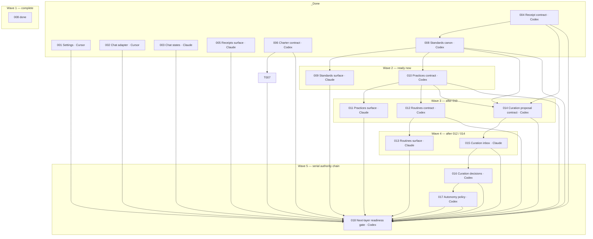

# Otto Parallel Map

Throughput principle: maximize **accepted** tickets per unit time. Parallelize independent chains; preserve isolated worktrees and independent review gates.

Updated: 2026-06-13 (loop tick 10 — 017 `_Done`; wave 5 head 018)

## Staging runtime (all lanes)

```txt
Live (never touch):     /Applications/otto.app
Staging smoke:          /Users/seb/.codex/admin/otto-staging/otto-staging.app
Staging launcher:       /Users/seb/.codex/admin/otto-staging/launch-otto-staging-smoke.sh
Staging deploy target:  /Applications/otto-staging.app
Deploy script:          apps/desktop/scripts/deploy-staging.sh
```

All runtime/UI proof uses staging with isolated HOME/OTTO_HOME. Do not close live Otto.

## Current state

```txt
_Done:     001, 002, 003, 004, 005, 006, 007, 008, 009, 010, 011, 012, 013, 014, 015, 016, 017, 032, 026, 027, 028, 029, 030, 031
_InReview: (none)
Root:      018
_Parked:   019, 020, 021, 022, 023, 024, 025
```

## Dependency DAG



## Ready now

| Lane | Ticket | Why ready | Guardrail |
|---|---|---|---|
| Codex | 017 Autonomy Policy | 016 `_Done` | gates from Standards/Curation; no fake autonomy |

## Parallel waves

| Wave | Can run in parallel | Waits for | Conflict notes |
|---|---|---|---|
| 5 | 017 → 018 Codex | 016 done ✓ | Serial authority/proof chain |

## File / domain conflicts

| Boundary | Tickets | Rule |
|---|---|---|
| App shell / nav / surface registry | 009, 011, 013, 015 | Parallel only with separate worktrees and explicit merge order |
| Canon loaders / schemas | 008, 010, 012, 014 | Codex owns contracts; avoid same files in parallel |
| Receipt/proof semantics | 004 done, 006, 014, 016, 018 | No fake proof; reviewer must map proof to `Done when` |
| Curation authority | 014, 016, 017 | Proposal → decision → autonomy is serial unless explicitly split by file/domain |
| Electron/adapter plumbing | 001, 002 done; future 020-022 | Cursor lane; one mechanical blocker at a time unless files split |

## Blocked / not ready

| Ticket | Blocked on |
|---|---|
| 017 | (ready) |
| 018 | 001-017 all `_Done` |
| 019-025 | `_Parked`; do not touch unless explicitly unparked |

## Cursor lane

Active root has no Cursor-owned ticket right now. Cursor can still clear isolated mechanical blockers that block active work, but must not take over Claude/Codex scope.

Future Cursor-owned parked tickets after 018/unpark:

```txt
020 Discord Approval Bridge
021 Paperclip Readonly Import
022 Paperclip Task Creation
```

## Recompute trigger

Refresh this file after any:

```txt
_Done move
_InReview move
review -1 / blocked / fake-done
unpark / reorder
new ticket
shared-file conflict discovered
```
